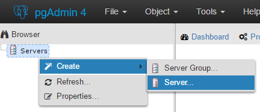
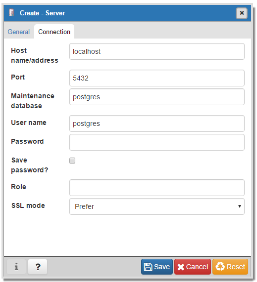
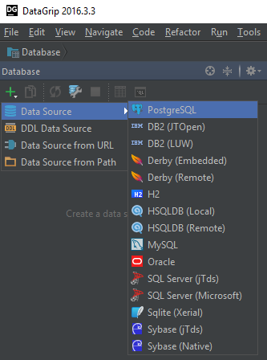
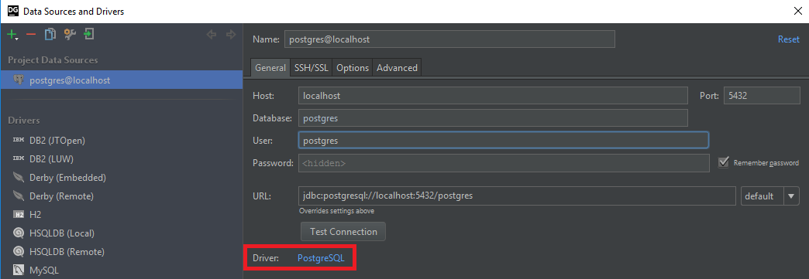

# Lab 1 — Basic setup
In this lab we wil create a simple PostgreSQL container and then try to connect to it.

## Start
Run:
```
docker-compose up -d
```

You can inspect `docker-compose.yml` file to see what exactly we're creating. It's very basic, but there are a couple of things to notice:
* We're specifying that we want PostgreSQL 9.6.1 (at the time of this writing this is the latest version supported by AWS RDS), not just any version. Unless you're a Russian roulette enthusiast, always specify the exact version of the image that you want to use.
* We map port 5432 on the container to the same port on the host. If you already have a PostgreSQL instance running on the host or are using this port in another container, this is not likely to work.
```
ERROR: for postgres  Cannot start service postgres: driver failed programming external connectivity on endpoint lab1_postgres_1 (29743455530c605d8576f52c7880d9b653dfbfd7fe48bebbe2098306820f8e2a): Bind for 0.0.0.0:5432 failed: port is already allocated
ERROR: Encountered errors while bringing up the project.
```
In this case just change the host port to a different value:
```yaml
    ports:
      - "5433:5432"
```
You will need to specify this port explicitly to connect to Postgres server from the host.

## Inspect
`docker-compose logs -f postgres`
This will give a fair bit of output. Take note of this part:
```
postgres_1  | WARNING: No password has been set for the database.
postgres_1  |          This will allow anyone with access to the
postgres_1  |          Postgres port to access your database. In
postgres_1  |          Docker's default configuration, this is
postgres_1  |          effectively any other container on the same
postgres_1  |          system.
postgres_1  |
postgres_1  |          Use "-e POSTGRES_PASSWORD=password" to set
postgres_1  |          it in "docker run".
postgres_1  | ****************************************************
```

Our database doesn't have a password for postgres user. We will fix this later, for now let's try connecting to it.

## Connect
### psql
psql is an essential command-line tool for managing PostgreSQL database.
In a new console session get an interactive bash session inside the Postgres container:
```
docker-compose exec postgres bash
```

Let's now try using psql:
```
psql
```
We will likely get the following output:
```
psql: FATAL:  role "root" does not exist
```
Unless we specify a valid Postgres role, psql will try to use the currently logged in user and fail as there's no such role on the server. You will see the same message in the logs that are still streamed to the first console session.

Let's specify the user explicitly:
```
psql -U postgres
```
We're in and can take a look around:
```
\dt+
```
There's not much to see here now, so we can `Ctrl+D` out of this session for now.

### PgAdmin
Right-click on 'Servers' and select 'Create > Server'.



Then specify the name of the server and connection parameters. We don't have a password, so we leave this field empty.



### JetBrains DataGrip
Connecting to a database is slightly less intuitive in DataGrip.
* Press `Alt+1` to open the Database View
* Press the green plus symbol, then select 'Data Source > PostgreSQL'


* Fill in the details - make sure to specify the user (`postgres`) and download the missing Postgres drivers. Press 'Test Connection' to verify that everything is working.



## Clean up
This was a very basic, but functional PostgreSQL setup.
Let's clean up the resources:
```
docker-compose down
```
