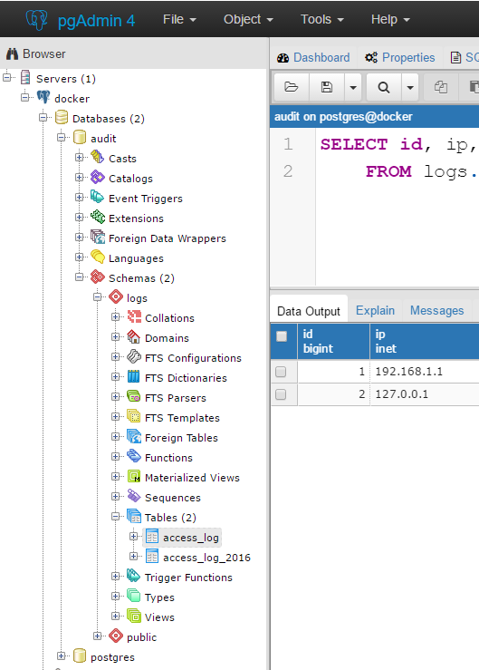
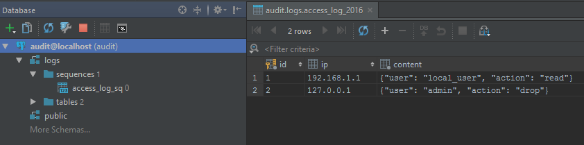

# Lab 2 — Extending the stock image
Having a working PostgreSQL server is nice, but it quickly becomes onerous to manually create databases and tables. There is a way to bootstrap our server with our schema definition and possibly some seed data which is required for ou application to function properly.

To achieve this, we will use our own image, which extends the official one by adding our schema definitions to it.

## docker-compose.yml
There are two main differences compared to `docker-compose.yml` in Lab 1:
* we will be using our own image, so instead of specifying the stock one with `image` option, we're pointing it to the folder which contains our `Dockerfile`:
```yaml
    build: ./postgres_server
```
* we are setting the default user and the password in the environment variables:
```yaml
    environment:
      - POSTGRES_USER=postgres
      - POSTGRES_PASSWORD=password1
```
Take note of the password, it will be required to connect to the server from now on.

## Dockerfile
Take a look at the [`Dockerfile`](./postgres_server/Dockerfile) that we will be using for our server. It's very simple, all it's doing is copying `docker-entrypoint-initdb.d/` folder to the image.
```Dockerfile
COPY ./docker-entrypoint-initdb.d/ /docker-entrypoint-initdb.d/
```
When a container is created from this image, all files in this folder with `*.sh` or `*.sql` extension will get executed in alphabetical order.

* [`01-init_db.sh`](./postgres_server/docker-entrypoint-initdb.d/01-init_db.sh) is a shell script which uses psql to pass commands to PostgreSQL. Notice that we perform some basic hardening, so that our new user cannot connect to the system `postgres` database.
* [`02-create_table.sql`](./postgres_server/docker-entrypoint-initdb.d/02-create_table.sql) is a SQL file with some embedded psql metacommands. In this case it's `\c users`, which connects to the `users` database — this is similar to `USE users;` in SQL server. This file also demonstrates some of the features specific to PostgreSQL, such as table inheritance, time ranges, and specialised data types.
* [`03-insert_dummydata.sql`](./postgres_server/docker-entrypoint-initdb.d/03-insert_dummydata.sql) adds some dummy data to the table.

## Create server container and explore the database
```
docker-compose up -d
```

Now try to connect to the system database using our new user:
```
docker-compose exec postgres_server psql -U docker -d postgres
```

We revoked public access from `postgres` database, so you should see an error:
```
psql: FATAL:  permission denied for database "postgres"
DETAIL:  User does not have CONNECT privilege.
```

This error will also show up in the container logs:
```
docker-compose logs -f postgres_server
```
```
postgres_server_1  | FATAL:  permission denied for database "postgres"
postgres_server_1  | DETAIL:  User does not have CONNECT privilege.
```

`docker` role can connect to the `audit` database:
```
docker-compose exec postgres_server psql -U docker -d audit
```
After we're in, we can start looking around, but for now let's use GUI tools, as `psql` will be covered in the next lab.

### PgAdmin
Connect to the server again, remembering to specify the password.
You can find our new table buried deep inside the `audit` database.



### DataGrip
In DataGrip you apparently connect to a database, not to the server as a whole. Edit the connection settings by specifying the database (`audit`) and the password (`password1`), then connect to the database and click `More schemas`.


## Clean up
Clean up before continuing to the next lab:
```
docker-compose down
```
